# Database Schema

This document catalogs the Supabase tables referenced by the application code.

Scope rules used for this document:

- Only tables referenced from the application are included.
- Relationships are documented when they are visible through joins, aliased relation selects, repeated key usage, or foreign-key names exposed in code.
- If a foreign-key constraint name is not visible in code, the relationship is described by column usage instead.

## ERD

```mermaid
erDiagram
    users ||--o{ backlogs : "created_by / validated_by / scheduled_by / supply_updated_by / closed_by"
    users ||--o{ repair_reports : "approved_by_id / submitted_by"
    users ||--o{ notifications : "target_user"

    equipment ||--o{ repair_reports : "equipment_id"
    problems ||--o{ repair_reports : "problems_id"
    failure ||--o{ repair_reports : "failure_id"
    diagnosis ||--o{ repair_reports : "diagnosis_id"
    reason ||--o{ repair_reports : "reason_id"
    finding ||--o{ repair_reports : "finding_id"
    area ||--o{ repair_reports : "area_id"
    action ||--o{ repair_reports : "action_id"
    instruction ||--o{ repair_reports : "instruction_id"
    sub_component ||--o{ repair_reports : "sub_component_id"
    activities ||--o{ repair_reports : "activity_id"
    activity_type ||--o{ repair_reports : "activity_type_id"
    repair_reports ||--o{ repair_reports_manpower : "report_id"
    manpower ||--o{ repair_reports_manpower : "manpower_id"

    equipment ||--o{ backlogs : "unit_code by business reference only"
    backlogs ||--o{ backlog_spareparts : "backlog_id"
    backlogs ||--o{ backlog_tools : "backlog_id"
    backlogs ||--o{ backlog_manpower : "backlog_id"
    backlogs ||--o{ backlog_shutdown : "backlog_id"
    backlogs ||--o{ backlog_closings : "backlog_id"
    backlogs ||--o{ backlog_assignments : "backlog_id"
    shutdown_events ||--o{ backlogs : "shutdown_event_id"
    manpower ||--o{ backlog_assignments : "manpower_id"

    equipment ||--o{ hour_meter_readings : "equipment_id"
    equipment ||--o{ components : "equipment_id"
    equipment ||--o{ maintenance_schedules : "equipment_id"
    components ||--o{ maintenance_schedules : "component_id"
    service_types ||--o{ maintenance_schedules : "service_type_id"
    equipment ||--o{ maintenance_executions : "equipment_id"
    components ||--o{ maintenance_executions : "component_id"
    service_types ||--o{ maintenance_executions : "service_type_id"
    employees ||--o{ maintenance_executions : "technician_id"
    equipment ||--o{ weekly_check_schedule : "equipment_id"

    tools ||--o{ tool_loans : "tool_id"
    employees ||--o{ tool_loans : "employee_id"
```

## Identity And Administration

## `users`

- Purpose: Application user profile table paired with Supabase Auth identities.
- Key columns seen in code: `id`, `email`, `name`, `role`, `created_at`, `nrp`, `username`.
- Foreign keys:
  - Referenced by `backlogs.created_by`
  - Referenced by `backlogs.validated_by`
  - Referenced by `backlogs.scheduled_by`
  - Referenced by `backlogs.supply_updated_by`
  - Referenced by `backlog_closings.closed_by`
  - Referenced by `repair_reports.approved_by_id`
  - Referenced by `repair_reports.submitted_by`
  - Referenced by `notifications.target_user`
- Relationships:
  - One user can create many backlogs.
  - One user can validate many backlogs.
  - One user can approve many repair reports.
  - One user can receive many notifications.
- Main workflows using the table:
  - Login profile hydration
  - User registration
  - Role management
  - Report approval
  - Backlog validation and audit display

## `action`

- Purpose: Report master data for corrective action classification.
- Key columns seen in code: `id`, `name`.
- Foreign keys:
  - Referenced by `repair_reports.action_id`
- Relationships:
  - One action can be linked to many repair reports.
- Main workflows using the table:
  - Report creation/edit
  - Admin master-data maintenance

## `activities`

- Purpose: Report master data for activity naming.
- Key columns seen in code: `id`, `name`.
- Foreign keys:
  - Referenced by `repair_reports.activity_id`
- Relationships:
  - One activity can be linked to many repair reports.
- Main workflows using the table:
  - Report creation/edit
  - Admin master-data maintenance

## `activity_type`

- Purpose: Report master data for activity type selection.
- Key columns seen in code: `id`, `name`.
- Foreign keys:
  - Referenced by `repair_reports.activity_type_id`
- Relationships:
  - One activity type can be linked to many repair reports.
- Main workflows using the table:
  - Report creation/edit
  - Admin master-data maintenance

## `area`

- Purpose: Report master data for area classification.
- Key columns seen in code: `id`, `name`.
- Foreign keys:
  - Referenced by `repair_reports.area_id`
- Relationships:
  - One area can be linked to many repair reports.
- Main workflows using the table:
  - Report creation/edit
  - Pareto analysis by area
  - Admin master-data maintenance

## `diagnosis`

- Purpose: Report master data for diagnosis classification.
- Key columns seen in code: `id`, `name`.
- Foreign keys:
  - Referenced by `repair_reports.diagnosis_id`
- Relationships:
  - One diagnosis can be linked to many repair reports.
- Main workflows using the table:
  - Report creation/edit
  - Admin master-data maintenance

## `failure`

- Purpose: Report master data for failure classification.
- Key columns seen in code: `id`, `name`.
- Foreign keys:
  - Referenced by `repair_reports.failure_id`
- Relationships:
  - One failure type can be linked to many repair reports.
- Main workflows using the table:
  - Report creation/edit
  - Admin master-data maintenance

## `finding`

- Purpose: Report master data for findings.
- Key columns seen in code: `id`, `name`.
- Foreign keys:
  - Referenced by `repair_reports.finding_id`
- Relationships:
  - One finding can be linked to many repair reports.
- Main workflows using the table:
  - Report creation/edit
  - Admin master-data maintenance

## `instruction`

- Purpose: Report master data for instruction classification.
- Key columns seen in code: `id`, `name`.
- Foreign keys:
  - Referenced by `repair_reports.instruction_id`
- Relationships:
  - One instruction can be linked to many repair reports.
- Main workflows using the table:
  - Report creation/edit
  - Admin master-data maintenance

## `manpower`

- Purpose: Shared people/skill master used in reports, backlog scheduling, and closure selection.
- Key columns seen in code: `id`, `name`, `nrp`.
- Foreign keys:
  - Referenced by `repair_reports_manpower.manpower_id`
  - Referenced by `backlog_assignments.manpower_id`
- Relationships:
  - One manpower row can be linked to many repair reports.
  - One manpower row can be assigned to many scheduled backlogs.
- Main workflows using the table:
  - Report manpower selection
  - Backlog scheduling
  - Backlog closure mechanic picker
  - Admin master-data maintenance

## `problems`

- Purpose: Report master data for problem classification.
- Key columns seen in code: `id`, `name`.
- Foreign keys:
  - Referenced by `repair_reports.problems_id`
- Relationships:
  - One problem type can be linked to many repair reports.
- Main workflows using the table:
  - Report creation/edit
  - Dashboard aggregation
  - Admin master-data maintenance

## `reason`

- Purpose: Report master data for reason classification.
- Key columns seen in code: `id`, `name`.
- Foreign keys:
  - Referenced by `repair_reports.reason_id`
- Relationships:
  - One reason can be linked to many repair reports.
- Main workflows using the table:
  - Report creation/edit
  - Admin master-data maintenance

## `sub_component`

- Purpose: Report master data for sub-component classification.
- Key columns seen in code: `id`, `name`.
- Foreign keys:
  - Referenced by `repair_reports.sub_component_id`
- Relationships:
  - One sub-component can be linked to many repair reports.
- Main workflows using the table:
  - Report creation/edit
  - Pareto analysis by sub-component
  - Admin master-data maintenance

## Daily Report Domain

## `repair_reports`

- Purpose: Primary daily repair / breakdown activity table.
- Key columns seen in code: `id`, `wo_number`, `equipment_id`, `problems_id`, `start_date`, `start_hour`, `finish_date`, `finish_hour`, `duration`, `hour_meter`, `approved_name`, `approved_by_id`, `approved_by`, `failure_id`, `diagnosis_id`, `reason_id`, `finding_id`, `area_id`, `action_id`, `instruction_id`, `sub_component_id`, `problem_description`, `part_number`, `part_causing_failure`, `mechanic_comment`, `status_breakdown`, `activity_status`, `submitted_by`, `activity_id`, `activity_type_id`, `status`, `created_at`.
- Foreign keys:
  - `equipment_id -> equipment.id`
  - `problems_id -> problems.id`
  - `failure_id -> failure.id`
  - `diagnosis_id -> diagnosis.id`
  - `reason_id -> reason.id`
  - `finding_id -> finding.id`
  - `area_id -> area.id`
  - `action_id -> action.id`
  - `instruction_id -> instruction.id`
  - `sub_component_id -> sub_component.id`
  - `activity_id -> activities.id`
  - `activity_type_id -> activity_type.id`
  - `approved_by_id -> users.id`
  - `submitted_by -> users.id`
- Relationships:
  - One equipment row can have many repair reports.
  - One repair report can have many `repair_reports_manpower` rows.
  - Many dashboards and exports aggregate directly from this table.
- Main workflows using the table:
  - Report create/edit
  - Report validation
  - Dashboard KPIs
  - Pareto charts
  - Report export

## `repair_reports_manpower`

- Purpose: Join table linking repair reports to manpower selections.
- Key columns seen in code: `report_id`, `manpower_id`.
- Foreign keys:
  - `report_id -> repair_reports.id`
  - `manpower_id -> manpower.id`
- Relationships:
  - Many-to-one to `repair_reports`
  - Many-to-one to `manpower`
- Main workflows using the table:
  - Report save/update
  - Report listing
  - Dashboard mechanic leaderboard
  - Report export

## `reports`

- Purpose: Legacy report table path still referenced by old helper code.
- Key columns seen in code: `id` plus unconstrained legacy payload access.
- Foreign keys:
  - Not visible in active routed flows.
- Relationships:
  - Used only by legacy helper/hook/page code paths.
- Main workflows using the table:
  - Legacy `useReports`
  - Legacy `ReportEdit`
  - Legacy helper functions in `src/lib/supabase.ts`

## Backlog Domain

## `backlogs`

- Purpose: Backlog header and main state-transition table.
- Key columns seen in code: `id`, `registration_code`, `unit_code`, `date`, `problem`, `need_sparepart`, `need_tools`, `need_manpower`, `need_shutdown`, `shutdown_required`, `priority`, `status`, `created_by`, `validated_by`, `validated_at`, `supply_updated_at`, `supply_updated_by`, `scheduled_date`, `shutdown_event_id`, `scheduled_by`, `scheduled_at`, `created_at`.
- Foreign keys:
  - `created_by -> users.id`
  - `validated_by -> users.id`
  - `supply_updated_by -> users.id`
  - `scheduled_by -> users.id`
  - `shutdown_event_id -> shutdown_events.id`
  - Explicit foreign-key names visible in code:
    - `backlogs_created_by_fkey`
    - `backlogs_validated_by_fkey`
    - `backlogs_scheduled_by_fkey`
- Relationships:
  - One backlog can have many spareparts, tools, manpower, shutdown-detail rows, closings, and assignments.
  - Many workflow notifications reference a backlog through `notifications.backlog_id`.
  - Work schedule and shutdown exports derive from backlog rows plus assignments.
- Main workflows using the table:
  - Backlog input
  - Backlog validation
  - Planner review
  - Supply update
  - Scheduling
  - Work calendar
  - Closing
  - Backlog dashboards and exports

## `backlog_spareparts`

- Purpose: Sparepart requirement lines per backlog.
- Key columns seen in code: `id`, `backlog_id`, `part_number`, `part_name`, `qty`, `stock_status`, `estimated_ready_date`, `remarks`, `no_wr_pr`, `no_po`, `image_url`, `created_at`.
- Foreign keys:
  - `backlog_id -> backlogs.id`
- Relationships:
  - Many sparepart rows can belong to one backlog.
- Main workflows using the table:
  - Backlog input
  - Planner review
  - Supply update
  - Backlog detail
  - Backlog and supply exports

## `backlog_tools`

- Purpose: Special-tool requirement lines per backlog.
- Key columns seen in code: `id`, `backlog_id`, `tool_name`, `specification`, `qty`, `remarks`, `created_at`.
- Foreign keys:
  - `backlog_id -> backlogs.id`
- Relationships:
  - Many tool rows can belong to one backlog.
- Main workflows using the table:
  - Backlog input
  - Planner review
  - Backlog edit/detail
  - Export

## `backlog_manpower`

- Purpose: Additional manpower requirement lines per backlog.
- Key columns seen in code: `id`, `backlog_id`, `skill_required`, `qty`, `remarks`, `created_at`.
- Foreign keys:
  - `backlog_id -> backlogs.id`
- Relationships:
  - Many manpower requirement rows can belong to one backlog.
- Main workflows using the table:
  - Backlog input
  - Planner review
  - Backlog edit/detail
  - Export

## `backlog_shutdown`

- Purpose: Shutdown activity rows attached directly to a backlog.
- Key columns seen in code: `id`, `backlog_id`, `activity_name`, `qty`, `remarks`.
- Foreign keys:
  - `backlog_id -> backlogs.id`
- Relationships:
  - Many shutdown-detail rows can belong to one backlog.
- Main workflows using the table:
  - Backlog edit
  - Backlog export

## `backlog_closings`

- Purpose: Closure audit rows for backlog completion.
- Key columns seen in code: `id`, `backlog_id`, `closed_by`, `closed_date`, `mechanic_name`, `created_at`.
- Foreign keys:
  - `backlog_id -> backlogs.id`
  - `closed_by -> users.id`
- Relationships:
  - One backlog can have closing records inserted from the closing workflow.
- Main workflows using the table:
  - Backlog closing
  - Backlog export

## `backlog_assignments`

- Purpose: Scheduled manpower assignment rows for backlogs.
- Key columns seen in code: `backlog_id`, `manpower_id`.
- Foreign keys:
  - `backlog_id -> backlogs.id`
  - `manpower_id -> manpower.id`
- Relationships:
  - One backlog can have many assigned manpower rows.
  - One manpower row can be assigned to many backlogs.
- Main workflows using the table:
  - Backlog scheduling
  - Work schedule calendar
  - Shutdown/work schedule export

## `notifications`

- Purpose: Workflow notification table.
- Key columns seen in code: `id`, `backlog_id`, `title`, `body`, `target_role`, `target_user`, `is_read`, `created_at`.
- Foreign keys:
  - `backlog_id -> backlogs.id`
  - `target_user -> users.id`
- Relationships:
  - Notifications can be scoped to a backlog, a role, or a specific user.
- Main workflows using the table:
  - Backlog validation notifications
  - Planner review notifications
  - Supply readiness notifications
  - Backlog closing notifications
  - Notifications list and unread badge

## `shutdown_events`

- Purpose: Planned shutdown windows.
- Key columns seen in code: `id`, `title`, `description`, `start_time`, `end_time`, `status`, `created_by`.
- Foreign keys:
  - `created_by -> users.id` by repeated usage pattern
  - Referenced by `backlogs.shutdown_event_id`
- Relationships:
  - One shutdown event can be linked from many backlogs.
- Main workflows using the table:
  - Shutdown planner CRUD
  - Backlog scheduling for shutdown work
  - Shutdown schedule export

## Mine Maintenance Domain

## `equipment`

- Purpose: Shared equipment master used in reports, backlogs, and mine-maintenance.
- Key columns seen in code: `id`, `code`, `name`, `type`, `model`, `serial_number`, `manufacturer`, `hour_meter`, `last_updated`, `average_hours_per_day`, `use_auto_calculation`.
- Foreign keys:
  - Referenced by `repair_reports.equipment_id`
  - Referenced by `hour_meter_readings.equipment_id`
  - Referenced by `components.equipment_id`
  - Referenced by `maintenance_schedules.equipment_id`
  - Referenced by `maintenance_executions.equipment_id`
  - Referenced by `weekly_check_schedule.equipment_id`
- Relationships:
  - One equipment row can have many reports, hour-meter readings, components, schedules, executions, and weekly checks.
  - Backlog forms use `equipment.code` as the selected unit reference.
- Main workflows using the table:
  - Report creation/edit
  - Backlog input
  - Mine-maintenance equipment CRUD
  - Hour-meter updates
  - Weekly checks
  - Maintenance scheduling/execution

## `components`

- Purpose: Equipment component table for maintenance planning and execution.
- Key columns seen in code: `id`, `equipment_id`, `name`, `category`, `serial_number`, `maintenance_interval`, `installation_date`, `last_maintenance_date`, `last_maintenance_hour`, `next_maintenance_hour`, `notes`.
- Foreign keys:
  - `equipment_id -> equipment.id`
  - Referenced by `maintenance_schedules.component_id`
  - Referenced by `maintenance_executions.component_id`
  - Referenced by `maintenance_records.componentId` through the context model
- Relationships:
  - Many components belong to one equipment row.
  - One component can appear in many maintenance schedules and executions.
- Main workflows using the table:
  - Component CRUD
  - Maintenance dashboard calculations
  - Maintenance scheduling
  - Maintenance execution

## `hour_meter_readings`

- Purpose: Equipment hour-meter history.
- Key columns seen in code: `id`, `equipment_id`, `reading_date`, `hours`, `created_at`.
- Foreign keys:
  - `equipment_id -> equipment.id`
- Relationships:
  - Many hour-meter readings belong to one equipment row.
- Main workflows using the table:
  - Report HM validation and upsert
  - Mine-maintenance HM update
  - Hour-meter history display

## `maintenance_settings`

- Purpose: Context-driven maintenance settings used in mine-maintenance screens.
- Key columns seen in code: `id`, `name`, `category`, `interval`.
- Foreign keys:
  - None visible in code.
- Relationships:
  - Used as standalone maintenance configuration data.
- Main workflows using the table:
  - Maintenance settings CRUD

## `maintenance_records`

- Purpose: Maintenance history table used by `MaintenanceContext`.
- Key columns seen in code: `id`, `componentId`, `componentName`, `equipmentId`, `date`, `hourMeter`, `nextMaintenanceHour`, `notes`, `maintenanceType`.
- Foreign keys:
  - `componentId -> components.id` by repeated usage pattern
  - `equipmentId -> equipment.id` by repeated usage pattern
- Relationships:
  - Used by the context-driven dashboard and history functions.
- Main workflows using the table:
  - Context-based maintenance history
  - Maintenance completion through `performMaintenance`

## `maintenance_schedules`

- Purpose: Planned maintenance schedule table.
- Key columns seen in code: `id`, `equipment_id`, `component_id`, `service_type_id`, `planned_date`, `planned_hour_meter`, `status`, `notes`.
- Foreign keys:
  - `equipment_id -> equipment.id`
  - `component_id -> components.id`
  - `service_type_id -> service_types.id`
- Relationships:
  - Many schedule rows can belong to one equipment row.
  - Many schedule rows can reference one component or one service type.
- Main workflows using the table:
  - Maintenance schedule listing
  - Add maintenance schedule modal
  - Maintenance record modal schedule lookup

## `maintenance_executions`

- Purpose: Executed maintenance work table.
- Key columns seen in code: `id`, `equipment_id`, `component_id`, `service_type_id`, `execution_date`, `hour_meter`, `technician_id`, `actual_work_performed`, `parts_used`, `notes`, `next_service_hour`, `actual_hour_interval`.
- Foreign keys:
  - `equipment_id -> equipment.id`
  - `component_id -> components.id`
  - `service_type_id -> service_types.id`
  - `technician_id -> employees.id`
- Relationships:
  - Many execution rows can belong to one equipment row.
  - Many execution rows can reference one component, one service type, and one employee.
- Main workflows using the table:
  - Maintenance record creation
  - Maintenance record listing

## `service_types`

- Purpose: Service-type master for scheduled and executed maintenance.
- Key columns seen in code: `id`, `name`, `category`, `planned_hour_interval`.
- Foreign keys:
  - Referenced by `maintenance_schedules.service_type_id`
  - Referenced by `maintenance_executions.service_type_id`
- Relationships:
  - One service type can be used by many schedule and execution rows.
- Main workflows using the table:
  - Maintenance schedule creation
  - Maintenance execution creation

## `employees`

- Purpose: Employee directory used in mine-maintenance and tool-room flows.
- Key columns seen in code: `id`, `name`, `position`, `register_number`.
- Foreign keys:
  - Referenced by `maintenance_executions.technician_id`
  - Referenced by `tool_loans.employee_id`
- Relationships:
  - One employee can perform many maintenance executions.
  - One employee can borrow many tools.
- Main workflows using the table:
  - Maintenance technician selection
  - Tool borrowing
  - Tool return/report joins

## `weekly_check_schedule`

- Purpose: Weekly pit-stop / weekly check planning and actual completion table.
- Key columns seen in code: `id`, `equipment_id`, `plan_date`, `actual_date`, `interval_days`.
- Foreign keys:
  - `equipment_id -> equipment.id`
- Relationships:
  - Many weekly-check rows can belong to one equipment row.
- Main workflows using the table:
  - Weekly check list
  - Weekly check creation
  - Actual-date update
  - Next-weekly-check generation

## Tool Room Domain

## `tools`

- Purpose: Tool inventory table.
- Key columns seen in code: `id`, `name`, `available_quantity`, `category`, `location`.
- Foreign keys:
  - Referenced by `tool_loans.tool_id`
- Relationships:
  - One tool can appear in many loan transactions.
- Main workflows using the table:
  - Tool list
  - Tool CRUD
  - Borrow flow
  - Dashboard counts

## `tool_loans`

- Purpose: Borrow/return transaction table for the tool room.
- Key columns seen in code: `id`, `tool_id`, `employee_id`, `quantity`, `expected_return_at`, `notes`, `status`, `created_by`, `borrowed_at`, `returned_at`, `return_photo_url`.
- Foreign keys:
  - `tool_id -> tools.id`
  - `employee_id -> employees.id`
  - `created_by -> users.id` by repeated usage pattern
- Relationships:
  - Many loan rows can belong to one tool.
  - Many loan rows can belong to one employee.
- Main workflows using the table:
  - Tool borrowing
  - Tool return
  - Tool-room dashboard
  - Tool-room reports/export

## Operational Energy Domain

## `energy_meter_readings`

- Purpose: Raw energy meter readings for operational monitoring.
- Key columns seen in code: `meter_type`, `reading_at`, `reading_value`, `created_by`.
- Foreign keys:
  - `created_by -> users.id` by repeated usage pattern
- Relationships:
  - Used as a time-series source; no table-to-table joins are visible in code.
- Main workflows using the table:
  - Energy input
  - Energy monitoring charts

## Table Relationship Summary

## Explicit foreign-key names exposed in code

- `backlogs_validated_by_fkey`
- `backlogs_created_by_fkey`
- `backlogs_scheduled_by_fkey`

## Relationship patterns visible without explicit constraint names

- Header-detail backlog model:
  - `backlogs` to `backlog_spareparts`, `backlog_tools`, `backlog_manpower`, `backlog_shutdown`, `backlog_closings`, `backlog_assignments`
- Header-detail report model:
  - `repair_reports` to `repair_reports_manpower`
- Equipment-centered maintenance model:
  - `equipment` to `components`, `hour_meter_readings`, `maintenance_schedules`, `maintenance_executions`, `weekly_check_schedule`
- Tool-room transaction model:
  - `tools` to `tool_loans`
  - `employees` to `tool_loans`

## Most Central Tables In The Current Application

- `backlogs`
- `repair_reports`
- `equipment`
- `users`
- `backlog_spareparts`
- `tool_loans`
- `notifications`
- `hour_meter_readings`
