# Database Usage

This document describes Supabase usage that is directly observable from the codebase. It avoids schema assumptions that are not visible in code.

## Supabase Features In Use

- Auth
  - `getSession`
  - `onAuthStateChange`
  - `signInWithPassword`
  - `signUp`
  - `getUser`
- Database
  - direct `select`, `insert`, `update`, `delete`, `upsert`
- Storage
  - bucket `sparepart-images`
  - bucket `tool-returns`
- Realtime
  - `postgres_changes` subscription on `notifications`
- RPC
  - `generate_backlog_registration_code`
  - `calculate_average_hours_per_day`
  - `get_waiting_for_parts_count`

## Tables Used

## Identity And Administration

### `users`

- Purpose:
  - application profile and role store
  - used alongside Supabase Auth user IDs
- Used by:
  - login profile hydration
  - registration
  - role management
  - report approver selection
  - backlog validator join
- Key columns referenced in code:
  - `id`
  - `email`
  - `name`
  - `role`
  - `created_at`
  - `nrp`
  - `username`

### Master Tables Used Through Admin Configuration

- `action`
- `activities`
- `activity_type`
- `area`
- `diagnosis`
- `failure`
- `finding`
- `instruction`
- `manpower`
- `problems`
- `reason`
- `sub_component`
- `equipment`

These are read by report and backlog screens and partly maintained by `Configuration.tsx`.

## Daily Report Domain

### `repair_reports`

- Purpose:
  - primary daily report table
- Used by:
  - report form
  - report list/detail
  - validation
  - dashboards
  - Pareto page
  - downloads

### `repair_reports_manpower`

- Purpose:
  - join table linking reports to manpower rows
- Used by:
  - report form save/update/delete
  - report list
  - dashboard
  - download export

### `hour_meter_readings`

- Purpose:
  - hour-meter history for equipment
- Used by:
  - report form validation/upsert
  - mine-maintenance hour-meter features
  - maintenance context

### `reports`

- Purpose in current code:
  - legacy helper/hook path only
- Used by:
  - `src/lib/supabase.ts`
  - `src/hooks/useReports.ts`
  - `src/pages/ReportEdit.tsx`
- Notes:
  - active app routes use `repair_reports`, not `reports`

## Backlog Domain

### `backlogs`

- Purpose:
  - backlog header record and status owner
- Used by:
  - input, validation, review, edit, detail, list, dashboards
  - supply management
  - scheduling
  - shutdown export
  - notifications

### `backlog_spareparts`

- Purpose:
  - sparepart requirements per backlog
- Used by:
  - backlog input/edit/review/detail
  - supply list/detail
  - backlog dashboards
  - exports

### `backlog_tools`

- Purpose:
  - special tool requirements per backlog
- Used by:
  - backlog input/edit/review/detail
  - exports

### `backlog_manpower`

- Purpose:
  - additional manpower requirements per backlog
- Used by:
  - backlog input/edit/review/detail
  - exports

### `backlog_shutdown`

- Purpose:
  - shutdown activity rows attached to a backlog
- Used by:
  - backlog edit page
  - backlog export utility

### `backlog_closings`

- Purpose:
  - closure audit row for a backlog
- Used by:
  - backlog closing
  - backlog export utilities

### `backlog_assignments`

- Purpose:
  - mechanic assignment rows for scheduled backlog work
- Used by:
  - scheduling
  - work calendar
  - shutdown/work-schedule exports

### `notifications`

- Purpose:
  - workflow notifications, mainly backlog-related
- Used by:
  - insert on status changes
  - unread badge count
  - notifications page

### `shutdown_events`

- Purpose:
  - shutdown planning windows
- Used by:
  - shutdown planner
  - backlog scheduling
  - work schedule
  - shutdown exports

## Mine Maintenance Domain

### `equipment`

- Purpose:
  - master equipment records
- Used by:
  - reports
  - backlog equipment selection
  - mine-maintenance CRUD
  - weekly checks
  - maintenance scheduling/execution

### `components`

- Purpose:
  - components installed on equipment
- Used by:
  - mine-maintenance context
  - maintenance modals and pages

### `maintenance_settings`

- Purpose:
  - maintenance setting definitions in the context-driven mine-maintenance module

### `maintenance_records`

- Purpose:
  - context-driven maintenance history table
- Used by:
  - `MaintenanceContext.tsx`

### `maintenance_schedules`

- Purpose:
  - schedule entries for planned maintenance
- Used by:
  - maintenance schedule page
  - maintenance record modal

### `maintenance_executions`

- Purpose:
  - executed maintenance work records
- Used by:
  - maintenance records page
  - maintenance record modal

### `service_types`

- Purpose:
  - service type master for maintenance schedules and executions

### `employees`

- Purpose:
  - employee directory
- Used by:
  - maintenance execution technician selection
  - tool-room borrower joins and selection

### `weekly_check_schedule`

- Purpose:
  - planned and actual weekly checks
- Used by:
  - weekly check page
  - weekly check modals
  - weekly check generation helpers

## Tool Room Domain

### `tools`

- Purpose:
  - tool inventory
- Used by:
  - tool CRUD
  - borrow flow
  - dashboard counts

### `tool_loans`

- Purpose:
  - borrowing and return transaction table
- Used by:
  - dashboard
  - borrow flow
  - return flow
  - reports

## Operational Energy Domain

### `energy_meter_readings`

- Purpose:
  - raw meter readings for PLN and genset tabs
- Used by:
  - energy input
  - energy monitoring calculations

## Storage Buckets

### `sparepart-images`

- Purpose:
  - uploaded sparepart request images from backlog input

### `tool-returns`

- Purpose:
  - return-photo evidence for tool returns

## Relationships Detected From Code

Only relationships that are explicitly visible through joins, aliased selects, or repeated key usage are listed below.

```mermaid
flowchart TD
    users -->|id = validated_by| backlogs
    users -->|id = created_by / supply_updated_by / scheduled_by / closed_by| backlogs
    backlogs -->|id = backlog_id| backlog_spareparts
    backlogs -->|id = backlog_id| backlog_tools
    backlogs -->|id = backlog_id| backlog_manpower
    backlogs -->|id = backlog_id| backlog_shutdown
    backlogs -->|id = backlog_id| backlog_closings
    backlogs -->|id = backlog_id| backlog_assignments
    shutdown_events -->|id = shutdown_event_id| backlogs
    manpower -->|id = manpower_id| backlog_assignments

    repair_reports -->|id = report_id| repair_reports_manpower
    manpower -->|id = manpower_id| repair_reports_manpower
    equipment -->|id = equipment_id| repair_reports
    problems -->|id = problems_id| repair_reports
    failure -->|id = failure_id| repair_reports
    diagnosis -->|id = diagnosis_id| repair_reports
    reason -->|id = reason_id| repair_reports
    finding -->|id = finding_id| repair_reports
    area -->|id = area_id| repair_reports
    action -->|id = action_id| repair_reports
    instruction -->|id = instruction_id| repair_reports
    sub_component -->|id = sub_component_id| repair_reports
    activities -->|id = activity_id| repair_reports
    activity_type -->|id = activity_type_id| repair_reports
    users -->|id = approved_by_id / submitted_by| repair_reports

    equipment -->|id = equipment_id| hour_meter_readings
    equipment -->|id = equipment_id| components
    equipment -->|id = equipment_id| maintenance_schedules
    components -->|id = component_id| maintenance_schedules
    service_types -->|id = service_type_id| maintenance_schedules

    equipment -->|id = equipment_id| maintenance_executions
    components -->|id = component_id| maintenance_executions
    service_types -->|id = service_type_id| maintenance_executions
    employees -->|id = technician_id| maintenance_executions

    equipment -->|id = equipment_id| weekly_check_schedule

    tools -->|id = tool_id| tool_loans
    employees -->|id = employee_id| tool_loans
```

## Foreign Keys Explicitly Visible In Code

The codebase only exposes one foreign-key constraint name directly:

- `backlogs_validated_by_fkey`

This appears in:

- `validated_by_user:users!backlogs_validated_by_fkey(name)` in `BacklogReview.tsx`

Other relationships are visible through Supabase relation-select syntax, but the actual database constraint names are not shown in code.

## Frequently Queried Tables

Tables with the broadest usage footprint in the codebase are:

- `backlogs`
- `repair_reports`
- `equipment`
- `backlog_spareparts`
- `users`
- `tool_loans`
- `notifications`
- `hour_meter_readings`

## RPC Usage

### `generate_backlog_registration_code`

- Called from backlog input when online.
- Used to generate a unique backlog registration code.

### `calculate_average_hours_per_day`

- Called when updating equipment hour-meter readings in mine maintenance.
- Used to calculate average equipment usage.

### `get_waiting_for_parts_count`

- Called from the home page summary.
- Used to populate the Supply Management waiting count card.

## Potential Orphan Or Integrity Risks Observed From Code

These are not schema statements. They are risks visible from application behavior.

- `equipment` deletion
  - Code deletes the equipment row directly, then refreshes equipment/components.
  - No client-side cleanup is shown for `components`, `hour_meter_readings`, `maintenance_schedules`, `maintenance_executions`, or `weekly_check_schedule`.

- `shutdown_events` deletion
  - The UI warns that related backlogs will lose their shutdown linkage.
  - The code deletes the shutdown event directly and does not update related backlogs first.

- `backlog` offline creation
  - Child rows are queued through `safeInsert`, but offline header creation does not return a generated backlog ID.
  - Child queue payloads can therefore be created with an undefined `backlog_id`.

- `tool_loans` and `tools.available_quantity`
  - Borrowing decrements available quantity in application code.
  - Return flow updates the loan row but does not update the tool inventory count.

- `notifications`
  - Unread badge queries target user/role scoped rows.
  - Notifications page currently fetches and bulk-updates all rows without that same scope.

- Mixed maintenance history tables
  - `maintenance_records` and `maintenance_executions` are both active in code.
  - This creates a risk of fragmented history across tables.

- Legacy `reports` table path
  - Some helpers still reference `reports` even though active routes use `repair_reports`.

## Observed Query Patterns

- Heavy client-side filtering after broad fetches:
  - backlog list
  - backlog dashboard
  - work schedule
  - notifications page
  - maintenance planning
- Repeated per-screen direct queries instead of a shared data service layer.
- Several writes are multi-step and not transaction-protected in the client:
  - report create + manpower link + hour-meter upsert
  - tool borrow + tool inventory update
  - backlog schedule + assignment replacement
  - backlog close + closing row insert + status update
