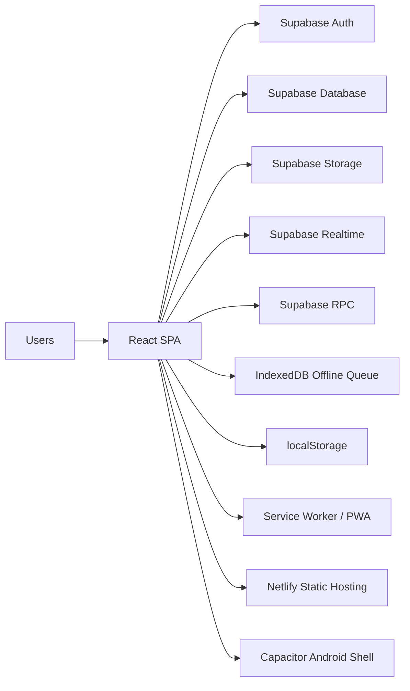
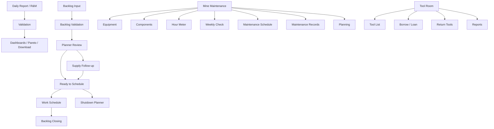

# Project Overview

## Purpose

MSM Application is a maintenance operations web application for day-to-day repair reporting, backlog management, supply follow-up, shutdown planning, mine-maintenance tracking, and tool-room administration. The application is built as a browser-based SPA and is also packaged for Android through Capacitor.

## Business Objectives

- Record daily repair and maintenance activity in a structured way.
- Move backlog items through validation, review, supply readiness, scheduling, and closure.
- Give planners, supervisors, supply staff, and mechanics a shared operating view.
- Track equipment, components, hour-meter readings, and recurring maintenance work.
- Manage tool borrowing and return evidence.
- Provide downloadable operational reports and dashboards.

## Main User Roles

Roles are read from `users.role` and then normalized in the UI. Current role handling in code includes:

- `admin`, `administrator`, `superadmin`
- `planner`
- `supervisor`
- `superintendent`
- `engineer`
- `groupleader`
- `mechanic`
- `sm`, `supply`, `supplymanager`, `supplymanagement`

Role-based menu visibility is implemented in `src/components/Layout.tsx`.

## System Architecture Overview

The repository contains no custom backend service. The application is a client-heavy React SPA that talks directly to Supabase from the browser.

## Frontend Stack

- React 18
- TypeScript
- Vite
- React Router
- Tailwind CSS
- Radix UI primitives
- React Select
- Recharts and Chart.js
- React Big Calendar
- `xlsx` and `file-saver` for exports
- `idb` for offline queue persistence
- `vite-plugin-pwa` for service worker + manifest generation

## Backend Stack

Backend capabilities are provided through Supabase:

- Supabase Auth for sign-in and sign-up
- Supabase Postgres for application data
- Supabase Storage for uploaded images
- Supabase Realtime channel for notification badge refresh
- Supabase RPCs used by the app:
  - `generate_backlog_registration_code`
  - `calculate_average_hours_per_day`
  - `get_waiting_for_parts_count`

No Netlify Functions, Edge Functions, or repository-owned server APIs are present.

## Hosting Architecture

Current repository evidence points to static hosting on Netlify:

- `vite.config.ts` contains comments specific to Netlify build handling.
- `public/_redirects` contains `/* /index.html 200` for SPA routing.
- Build output is `dist/`.
- `generate-version.js` writes `public/version.json` before build for update detection.

The same built web assets are also referenced by Capacitor:

- `capacitor.config.ts` points `webDir` to `dist`.
- An Android project exists under `android/`.

## Authentication Architecture

Authentication is browser-side and Supabase-based:

- Session bootstrap: `supabase.auth.getSession()`
- Sign-in: `supabase.auth.signInWithPassword`
- Registration: `supabase.auth.signUp`, then profile upsert/insert into `users`
- Auth state listener: `supabase.auth.onAuthStateChange`
- Session persistence: enabled in `src/lib/supabase.ts`
- Route protection: `ProtectedRoute` in `src/App.tsx`
- Authorization: mostly role-based menu and page guards in UI code

Notable implementation detail:

- Logout currently clears local auth storage instead of calling `supabase.auth.signOut()`.

## Storage Architecture

The application uses three storage layers:

### 1. Supabase Database

Primary system of record for reports, backlogs, users, equipment, tool-room data, notifications, and energy data.

### 2. Supabase Storage Buckets

- `sparepart-images`
- `tool-returns`

### 3. Browser Storage

- `localStorage`
  - persisted Supabase auth tokens
  - `unsavedReportForm`
  - logout signal key `app:logout`
- IndexedDB
  - database: `msm-offline-db`
  - object store: `queue`
  - used by the offline sync helper

## High-Level Functional Areas

## Current Architectural Characteristics

- Most business logic sits inside pages and React contexts, not in a backend service layer.
- Supabase access is spread across many components and pages.
- The backlog module has the richest workflow state machine in the application.
- The app includes PWA and offline-queue building blocks, but offline support is not uniform across modules.
- The repository contains a mix of active and transitional patterns, especially around reports and mine-maintenance data models.
