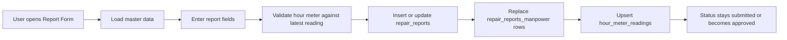
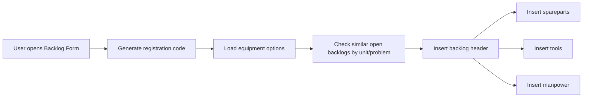
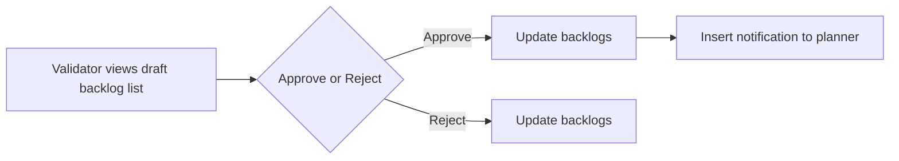
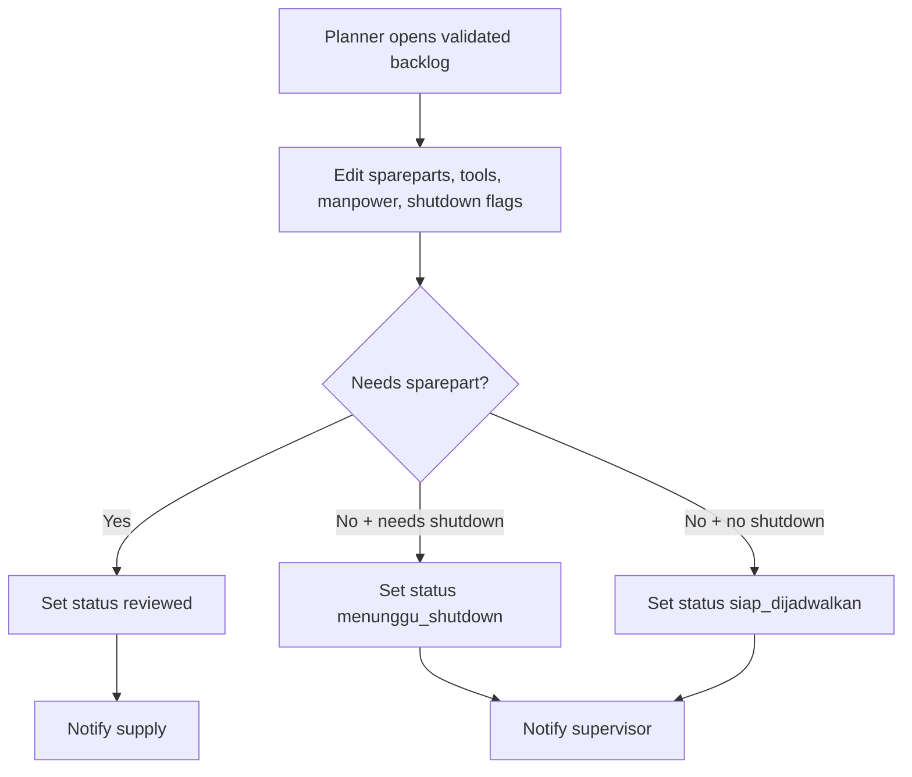
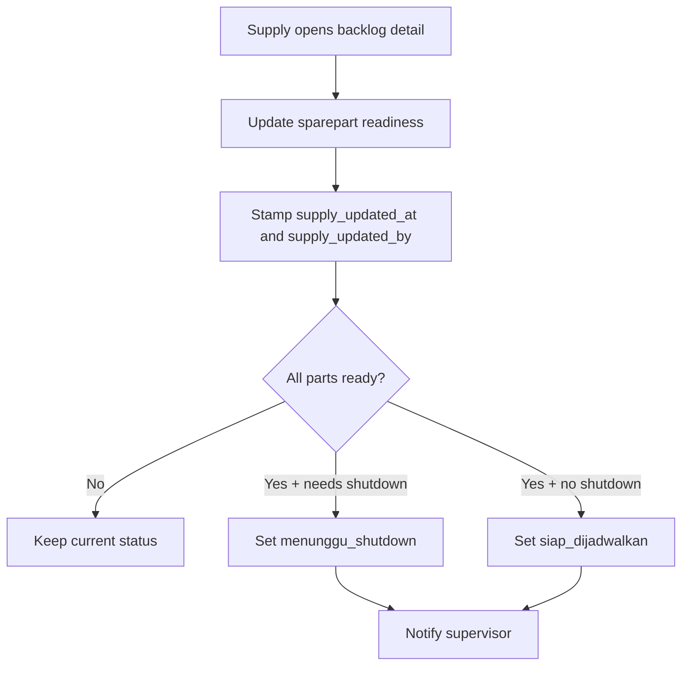
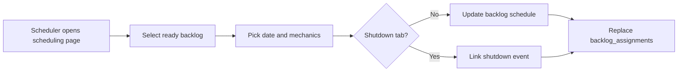
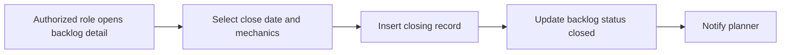
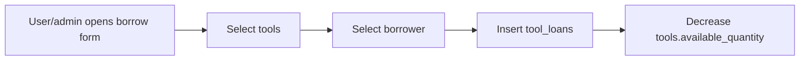
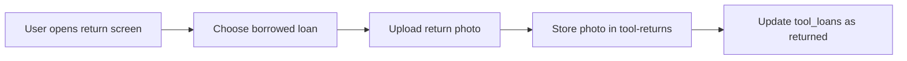

# Workflows

This document summarizes workflows that are directly implemented in the current application code.

## 1. Daily Report Creation And Validation

### Actors

- Mechanic or general user: create/edit report
- Validator role users except mechanic: approve or reject

### Database Impact

- `repair_reports`
  - insert on new report
  - update on edit
  - update `status`, `approved_by`, `approved_by_id`, `approved_name` during validation
- `repair_reports_manpower`
  - delete existing rows and reinsert selected manpower links
- `hour_meter_readings`
  - validate against latest prior reading
  - upsert current reading by `equipment_id + reading_date`

### Status Changes

- New report default: `submitted`
- Validation approval: `approved`
- Validation rejection: `rejected`

## 2. Backlog Creation

### Actors

- Planner, supervisor, mechanic, or other allowed roles with backlog access

### Database Impact

- `backlogs`
  - inserted with:
    - `unit_code`
    - `date`
    - `problem`
    - requirement flags
    - `shutdown_required`
    - `registration_code`
    - `priority`
    - `status = draft`
    - `created_by`
- `backlog_spareparts`
  - inserted when spareparts are required
- `backlog_tools`
  - inserted when tools are required
- `backlog_manpower`
  - inserted when manpower is required
- Storage:
  - optional upload to `sparepart-images`

### Status Changes

- New backlog starts as `draft`

### Offline Behavior

- Backlog form uses `safeInsert`
- When offline, writes are queued into IndexedDB for later replay

## 3. Backlog Validation

### Actors

- Non-mechanic validator

### Database Impact

- `backlogs`
  - approve:
    - `status = validated`
    - `validated_by`
    - `validated_at`
  - reject:
    - `status = rejected`
- `notifications`
  - inserted on approval with `target_role = planner`

### Status Changes

- `draft -> validated`
- `draft -> rejected`

## 4. Planner Review

### Actors

- Planner

### Database Impact

- `backlog_spareparts`
  - delete removed rows
  - upsert current rows
- `backlog_tools`
  - delete removed rows
  - upsert current rows
- `backlog_manpower`
  - delete removed rows
  - upsert current rows
- `backlogs`
  - update requirement flags
  - update `shutdown_required`
  - update `status` based on review outcome
- `notifications`
  - inserted with target role:
    - `supply` when sparepart follow-up is required
    - `supervisor` when ready for scheduling or waiting shutdown

### Status Changes

- `validated -> reviewed`
- `validated -> menunggu_shutdown`
- `validated -> siap_dijadwalkan`

## 5. Supply Update

### Actors

- Supply management role

### Database Impact

- `backlog_spareparts`
  - update row-by-row:
    - `part_number`
    - `part_name`
    - `qty`
    - `no_wr_pr`
    - `no_po`
    - `remarks`
    - `stock_status`
    - `estimated_ready_date`
- `backlogs`
  - update:
    - `supply_updated_at`
    - `supply_updated_by`
    - sometimes `status`
- `notifications`
  - inserted when readiness changes backlog status

### Status Changes

- `reviewed -> siap_dijadwalkan` when all parts are ready and no shutdown is needed
- `reviewed -> menunggu_shutdown` when all parts are ready and shutdown is still needed

## 6. Backlog Scheduling

### Actors

- Planner or supervisor-type role

### Database Impact

- `backlogs`
  - update:
    - `status = dijadwalkan`
    - `scheduled_date`
    - `shutdown_event_id` for shutdown tab
    - `scheduled_by`
    - `scheduled_at`
- `backlog_assignments`
  - delete existing rows for the backlog
  - insert selected mechanic assignments

### Status Changes

- `siap_dijadwalkan -> dijadwalkan`
- `menunggu_shutdown -> dijadwalkan`

## 7. Backlog Closing

### Actors

- `group_leader`
- `supervisor`
- `planner`
- `admin`

### Database Impact

- `backlog_closings`
  - insert:
    - `backlog_id`
    - `closed_by`
    - `closed_date`
    - `mechanic_name`
- `backlogs`
  - update `status = closed`
- `notifications`
  - insert with `target_role = planner`

### Status Changes

- any active backlog status shown in detail page -> `closed`

## 8. Shutdown Event Maintenance

### Actors

- Non-mechanic user with access to shutdown planner

### Actions And Database Impact

- Create shutdown event
  - insert into `shutdown_events`
- Edit shutdown event
  - update `shutdown_events`
- Delete shutdown event
  - delete from `shutdown_events`
- Export event schedule
  - read `backlogs` joined to `backlog_assignments(manpower)` for matching `shutdown_event_id`

### Status Changes

- No backlog status change is triggered directly by event creation/edit/delete.
- Backlogs consume event IDs during scheduling.

## 9. Tool Borrowing

### Actors

- Admin can borrow on behalf of an employee
- Non-admin borrows as the logged-in user

### Database Impact

- `tool_loans`
  - insert one row per selected tool with:
    - `tool_id`
    - `employee_id`
    - `quantity`
    - `expected_return_at`
    - `notes`
    - `status = borrowed`
    - `created_by`
- `tools`
  - update `available_quantity` by subtracting borrowed quantity

### Status Changes

- Loan row starts as `borrowed`

## 10. Tool Return

### Actors

- Tool-room user

### Database Impact

- Storage:
  - upload return evidence to `tool-returns`
- `tool_loans`
  - update:
    - `status = returned`
    - `returned_at`
    - `return_photo_url`

### Status Changes

- `borrowed -> returned`

## 11. Mine Maintenance Hour-Meter Update

### Actors

- Mine-maintenance user

### Database Impact

- `hour_meter_readings`
  - insert a new reading
- RPC `calculate_average_hours_per_day`
  - called when auto-calculation is enabled
- `equipment`
  - update:
    - `hour_meter`
    - `last_updated`
    - `average_hours_per_day`
    - `use_auto_calculation`

### Status Changes

- No explicit status field transition, but this affects maintenance planning and due/overdue calculation.

## 12. Weekly Check Lifecycle

### Actors

- Mine-maintenance user

### Database Impact

- `weekly_check_schedule`
  - insert planned checks
  - update `actual_date`
  - read grouped schedule entries for dashboard-style weekly display

### Status Logic

Computed in UI, not stored as a dedicated field:

- `Done` when `actual_date` exists
- `Missed` when current date is past `plan_date`
- `Pending` otherwise

## 13. Maintenance Schedule And Execution

### Actors

- Mine-maintenance user

### Database Impact

- `maintenance_schedules`
  - insert schedule rows
  - list by equipment/component/service type
- `maintenance_executions`
  - insert execution rows
  - list execution history
- supporting masters:
  - `equipment`
  - `components`
  - `service_types`
  - `employees`

### Status Changes

- Schedule rows are read with statuses such as:
  - `pending`
  - `due`
  - `overdue`
  - `completed`
- The schedule page itself reads these statuses; it does not compute them client-side.

## 14. Energy Input And Monitoring

### Actors

- Operational user

### Database Impact

- `energy_meter_readings`
  - insert one or more reading rows depending on active tab:
    - `PLN_GI`
    - `PLN_GH`
    - `GENSET_SUTM`
    - `GENSET_OPP`
- monitoring page reads yearly ranges and calculates monthly deltas in the client

### Status Changes

- No persisted workflow status

## Workflow Status Summary

### Daily Reports

- `submitted`
- `approved`
- `rejected`

### Backlogs

- `draft`
- `validated`
- `reviewed`
- `menunggu_shutdown`
- `siap_dijadwalkan`
- `dijadwalkan`
- `closed`
- `rejected`

### Tool Loans

- `borrowed`
- `returned`

### Weekly Checks

- computed UI statuses:
  - `Done`
  - `Pending`
  - `Missed`
